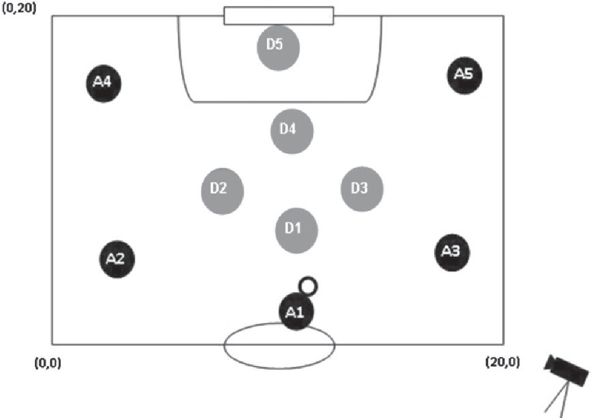

---
output:
  xaringan::moon_reader:
    css: [default, "VictoriaUniversity.css", "VictoriaUniversity-fonts.css"]
    nature:
      highlightStyle: github
      highlightLines: true
      countIncrementalSlides: false
      ratio: 16:9 
      beforeInit: "https://platform.twitter.com/widgets.js"
      
---
class: title-slide
background-image: url(Baseball.jpg)
background-size: cover 

# Introduction to Complex Systems
   
 
```{r setup, include=FALSE}
options(htmltools.dir.version = FALSE, knitr.table.format = "html")
knitr::opts_chunk$set(fig.retina = 3, warning = FALSE, message = FALSE)
library(icon)      
library(tidyverse) 
library(emo) 
library(fontawesome)

#    
```

```{r xaringan-tachyons, echo=FALSE}
xaringanExtra::use_tachyons()
```

```{r xaringan-panelset, echo=FALSE}
xaringanExtra::use_panelset()
```

```{r xaringan-extra-styles, echo=FALSE}
xaringanExtra::use_extra_styles(
  hover_code_line = TRUE,         #<<
  mute_unhighlighted_code = TRUE  #<<
)
```

---
class: center, top
# What is Complex Systems in Sport?

.center[

]

???
- Statements such as "I see them moving together like a flock of birds" or "Its not just a matter of running more than the opposing team, if we are organised, we may even run less" contradict popular beliefs and mechanistic views in sports analytics and coaching that events happen in sport in a reductionist manner
- Here we have an NBA team responding to the ball and a match event in a synchronise manner. This is of course is one incident and a snapshot from a larger game, that could be chance, but a small example of teams moving collectively together in response to an event
- These athletes are responding to events happening within their environment (missed shot on goal)

---
class: left, top
.center[
# What is Complex Systems in Sport?
]

* Diverse components (athletes, teams, games etc) which interact, adapt and fit their behaviour to different constraints

--

* May behave in a simple fashion, because of their interacting components behaving cooperatively

.center[

]

---
class: left, top
.center[
# What is Complex Systems in Sport?
]

* Diverse components (athletes, teams, games etc) which interact, adapt and fit their behaviour to different constraints

* May behave in a simple fashion, because of their interacting components behaving cooperatively

   * Or behave in a very complex and unpredictable manner

.center[

]

---
class: left, top
.center[
# What is Complex Systems in Sport?
]

* Diverse components (athletes, teams, games etc) which interact, adapt and fit their behaviour to different constraints

* May behave in a simple fashion, because of their interacting components behaving cooperatively

   * Or behave in a very complex and unpredictable manner

* Offers an opportunity to replace a mechanistic or typical reductionist view on sport-related phenomena

--
.center[

] 

.right[
.small[Fossion et al., (2019)]
]

???
- Coordination dynamics, is one approach to look at this complexity and is is defined as the science of coordination, that describes, explains, and predicts how patterns of coordination form, adapt, persist, and change in living things.
-  The aim of this field of work is to understand principles and laws that lead the dynamics of behavioural pattern formation under changing constraints (i.e., boundary conditions). 
- These constraints may be classified into three sub-classes: Task constraints, personal constraints, and environmental constraints (talk more about ecological dynamics and constraints led approach soon)
- Defining coordination dynamics is challenging, given the interactions between physiological and psychological processes, that alter under these constraints 
- Similarly, understanding How and which constraints lead to which spontaneous reorganizations of intra-personal and inter-personal coordination requires a great deal of time and energy
- Put simply, rather than focusing on what athletes or perfomers do, we can start to focus on why and how they do it

---
class: center, top

# Inter-Personal Coordination Dynamics in Sport



.right[
.small[Travassos et al., (2011)]
]
 
???
- The scientific analysis of team sports has tended to focus in the main on identifying discrete performance variables, and reporting on their instances using descriptive measures such as data frequencies, and action sequence chains.
- Coordination patterns of sports behavior emerge as a result of constantly changing conditions for players and/or team
- Behavior on the game and its sub-phases should be viewed as an adapting selforganizing process whose patterned features emerge from the playing interactions operating under various constraints
- Informational constraints, such as the location of the ball and individual players, may be important in shaping the behavioral coordination dynamics
- This research looked at how team sport athletes (in this case, Futsal) move, in relation to each other and the ball, as a as self-organizing complex system
- Here we have a schematic view of the pitch (attacking half only) and futusal player identities based on team membership and starting positions (A – Attackers and D – Defenders). The positions and ball were recorded via computer vision (talk more about this technology in another session)
- The weaker phase attraction to the ball for the attackers is denoted by increased phase variability, a feature of meta-stable dynamical systems that promote the likelihood of system transitions between different regions of varying stabilities
- Increased phase variability is furthermore consistent with the collective aim of the attacking team seeking to create spaces within otherwise contained dynamic game configurations

---
class: center, top


.right[
.small[Bourbousson et al., (2010)]
]

???
- The adoption of the environment-performer system as unit of study helps understanding how sport techniques, tactical strategies, decisions, and actions emerge without over-reliance on encapsulated predefined hierarchical structures - such as brain processors or motor programs.
- Complexity science applications include: How groups of cyclists, runners, or sport fans are spontaneously formed during practice or competition; and, how decisions to shoot or to pass, to dribble or to score, to advance up field or to stay back, to attack or to wait emerge without previous programs stored in the brain of the players
- Early applications focused on motor control and learning, via limb or finger movements that were then modelled
- In sport, decision making is seen as a self-organising process that emerges as a consequence of an athlete interacting with the environment around them
- Here we have a time line of the changing basketball game score and location of the data sequences extracted for analysis (upper panel). The individual data sequences and the time line of important game events, including team in possession, type of play, shot attempts, steals, fouls, and out of bounds (lower panel).

---
class: center, top

#Applications of Complex Systems in Sport


.right[
.small[Bourbousson et al., (2010)]
]

???
- Representation of the spatial centre and the stretch index for each team. Solid circles represent the players on the two teams (grey and black). Solid squares represent the spatial centre of each team. Line distances extending from the spatial centres to each of the respective players represent each player's contribution to his team's stretch index.

---
class: center, top


.right[
.small[Bourbousson et al., (2010)]
]

???
- Here we have Relative-phase (RP) analysis between the spatial centres of the two basketball teams, presenting unfiltered data of displacements and relative-phase dynamics from a single sequence, and frequency histograms of the overall relative-phases.

---
class: center, top

#Applications of Complex Systems in Sport


.right[
.small[Bittencourt et al., (2016)]
]

???
- conceptual paper was to propose a complex systemmodel for sports injuries and to demonstrate how the implementation of complex system thinking may allow us to better address the complex nature of the sports injuries
- Here we have a Complex model for sports injury. The group of variables at the bottom makes up the web of determinants, which is composed of
contributing units with different weights. Variables circled by darker lines have more interactions than variables circled by lighter lines and exert a greater influence on the outcome. Dotted lines represent a weak interaction and thick lines represent a strong interaction between variables. Arrows indicate the relationship between the observable regularities, which captures the risk/protective profile, and the emerging outcome

---
class: center, top

#Applications of Complex Systems in Sport


.right[
.small[Bittencourt et al., (2016)]
]

???
- Here we have an example of the web of determinants for an ACL injury

---
class: right, bottom, inverse
background-image: url(SoccerBall.jpg)
background-size: cover 


# Summary of Complex Systems


Considers complexity, interactions and non-linearity

--

Challenges reductionist or mechanistic thinking

--

Used to explore interactions between teams and the ball

--

Can take time/ computing power to define and analyse

???
- Can also be tricky to evaluate how effective they are and truly capture when sytems are working together coherently
- Language/ accessibility of the theoretical framework, especially for beginners/ those outside the skill acq or motor learning area


---
class: left, bottom
background-image: url(Skis.jpg)
background-size: cover 

.NonVU[
# Ecological Dynamics
]


???
- This approach treats the performer-environment system as a relevant level of analysis and explanation in sports settings. The approach is based on two theoretical and formal pillars such as: ecological psychology of perception[15] and Haken’s synergetics approach[16], as a relevant one in dealing with problems of dimension reduction and self-organization in complex nonlinear systems and their dynamical formulation
- ED involves where behavior is a self-organizing phenomenon that emerges from the continuously dynamic interplay of an organism’s characteristics and the affordances (possibilities for action) offered in a specific competitive performance environment 
- Skilled behavior therefore evolves over timescales of performance, learning, and development. Ecological dynamics is grounded in Gibson's work on perception in ecological psychology and Kelso's work on coordination dynamics. 
- The perception and action of an individual are tightly coupled, so think a team-sport athlete responding to where their direct opponent is moving, the flight of the ball and the direction of the wind, as they attempt to catch or mark a ball.


---
class: left, top

.center[
# Ecological Dynamics
]

* Humans and groups are *complex adaptive systems* with inherent non-linear properties

.citation[
.right[
Woods et al., (2020)
]
]

--

* Variability can be functional and dysfunctional, likely based on the skill level of athletes 

--

* Practice design for athletes = opportunities to solve problems
.center[

]
.left[
.small[Image from Davids et al., (2003)]
]


???
- There is an over-emphasis on the measures of performance outcome variability (such as standard deviations and coefficients of variation) in sport and movement science research, which typically focuses on the magnitude of variability in task outcomes.
- This is only part of the picture and biased to the view that variability is often equated with “noise” or error in humans, considered as information-processing channels. This conceptualization is likely due to the linear movement models that were popular in motor behavior theories in the 1960s to the 1970s and that somewhat still prevail in current practice
- Variability in such systems needs to be much more carefully interpreted in a nuanced way, which is the challenge for sports practitioners interested in enhancing athlete and team performance.
- Understanding the change in variability profile at each level, in particular during any interaction with motor learning and/or adaptation, could provide insight into how any functional role of variability emerges.
- Movement pattern variability can support the skill adaptations needed as the influence of task constraints on athlete behaviors emerges during practice and performance. 
- The implications for practice and performance were captured in the phrase of “repetition without repetition,” indicating how practice designs for trainers and coaches should provide opportunities for athletes to solve performance problems in different ways using a variety of behaviors.
- The ecological dynamics framework has emphasized how the role of the sports practitioner has evolved from an autocratic instructor and more to an instructor with a deep understanding of task, personal, and environmental constraints on individual learners and finding ways to co-design learning environments replete with affordances to guide each learner toward active exploration of a range of performance solutions

---
class: left, top

.center[
# Ecological Dynamics
]

* Humans and groups are *complex adaptive systems* with inherent non-linear properties

.citation[
.right[
Woods et al., (2020)
]
]

* Variability can be functional and dysfunctional, likely based on the skill level of athletes 

* Practice design for athletes = opportunities to solve problems

.center[

]
.left[
.small[Image from the Action Perception Podcast]
]

???
- Examples of task constraints include number of balls in a training drill or practice activity, the number of players and rules of the game or drill
- Examples of environmental constraints include temperature, wind speed, humidity, ground surface
- Examples of performer or organism constraints include features such as body size, height, weight, aerobic capacity, strength etc

---
class: left, bottom
background-image: url(Skis.jpg)
background-size: cover 

.NonVU[
# Ecological Dynamics
]

* Interactions between performer and environment

---
class: left, bottom
background-image: url(Skis.jpg)
background-size: cover 

.NonVU[
# Ecological Dynamics
]

* Constraints led approach = task, environmental and performer

---
class: left, bottom
background-image: url(Skis.jpg)
background-size: cover 

.NonVU[
# Ecological Dynamics
]

* Movement pattern variability 

???

* Movement pattern variability can support the skill adaptations needed as the influence of task constraints on athlete behaviors emerges during practice and performance

---
class: left, bottom, inverse
background-image: url(SoccerFieldBall.jpg)
background-size: fill 

# Grounded Theory

???
- A qualitiative methodology based on the premise that theory is indispensable for gaining deep knowledge of social phenomena
- Orginated in sociology in the 1960s
- Arrived in the sport and exercise literature in around the 2000s
- Often the term ground theory is under interchangably within the process of and the product of research

---
class: left, top

.center[
# Grounded Theory
]

* Systematic yet flexible way of capturing qualitative data through a research process

.citation[
Routledge Handbook of Qualitative Research in Sport and Exercise (2016)
]

???
-	Grounded theory has been described as a systematic yet flexible way of capturing qualitative data through a research process

--

* End product is to develop a theory and concepts that are grounded in data collected

???
-	Differs to content and thematic analysis, whereby the end product of using grounded theory methodology is to not come up with a list of themes but rather concepts that are grounded in the data collected in the field. Grounded theories should also have practical applications


--

* Versions of grounded theory methodology have developed over time
 * Up to the analyst to discover theory in data
 * Multiple realities and different ways of viewing a dataset

???
-	Early versions of grounded theory methodology have developed over time, one view of grounded theory methodology that declares the theory is embedded in the data and it is up to the analyst to discover the theory
-	The other view of grounded theory methodology acknowledges there are multiple realities and different ways of viewing a dataset

--

* Suited to developing patterns of action and inaction within a context

???
-	Research questions that are well suited to grounded theory methodology include those focused on developing patterns of action and interaction with conditions or to explain a certain social process
- Theoretical frameworks fit within literature reviews to scope what exists, what questions could be developed and provide justification for research/ projects

---
class: center, top

# Grounded Theory in Sport


.left[
.small[Image from MAXQDA]
]

???
-	Iterative process of data sampling

---
class: center, top

# Grounded Theory in Sport - Applications


.left[
.small[Smrdu (2015)]
]


???
- an insight into the complexity of human experience for optimal performance
- interviewed 14 elite team athletes about their experience of a recent competitive optimal sport performance. 
- The qualitative analysis showed that achieving an optimal performance is a dynamic process during which different factors, that establish complex relations, are important. 
- Optimal performance started with a preceding challenging situation in which no solution to the problem could be found quickly and in response to which situational anxiety developed. However, athletes decided on an active approach and took responsibility for their action
- Trust emerged as a crucial factor
- Image is a grounded theory model of the experiential path towards an optimal sport performance. Brackets containing partial external events, square shapes are preceeding factors and ovals note experiences. 

---
class: center, top

# Grounded Theory in Sport - Applications


.left[
.small[Kendellen et al., (2018)]
]


???
- The purpose of the study was to examine how athletes apply in life the skills learned or refined in sport in order to develop new theoretical explanations for life skills application in at least one life domain beyond sport 
- Data collection occurred over 10 months, involving interviews, chronological charts, timelines, and journals with (n = 13) athletes
- Within the theory developed, skill application is framed as an ongoing process that involves four steps (a) decision‐making, (b) application, (c) appraisal, and (d) adaptation

---
class: left, bottom, inverse
background-image: url(SoccerFieldBall.jpg)
background-size: fill 

# Grounded Theory

???
- A framework that allows us to produce an explanatory theory to help gain more information on a process
- Differs to the complex systems and ecological dynamics as is a way to uncover processes from data
- Applications might be looking at warm up or pre-competition routines, recovery processes and potentially nutritional patterns

---
class: right, bottom, inverse
background-image: url(CoffeeLaptop.jpg)
background-size: cover 

.NonVU[
# Computational Thinking
]

???
- Take a complex problem, understand what the problem is and develop possible solutions, for computers and humans or both.
* Along with acquiring these technical computational skills, via learning a program language, those working in sport science can also become adaptable by adopting computational thinking
* Computational thinking refers to the “thought processes involved in formulating a problem and expressing its solution(s) in such a way that a computer – human or machine, can effectively carry out” (Wing, 2014). Computational thinking has joined theory and experimentation as the third recognised pillar of science
* Encourages logical organisation of data, abstractions and pattern recognition, reformulating problems, process efficiency and automation.
* A major benefits is that the method typically provides a multitude of solutions to the same problem. 
* Has been used in education to help students learn a programming language

---
class: right, bottom, inverse
background-image: url(https://www.researchgate.net/publication/333826796/figure/fig1/AS:770829965082628@1560791593890/The-elements-of-computational-thinking.jpg)
background-size: fill 

.citation[
Harimurti et al., (2019)
]

???
- Computational thinking is a process of problems solving and designing systems using concepts in computer science
- Computational thinking is based on a computational principle that involves a wide range of approaches and skills with applications in several disciplines. 
- Computational thinking has been widely applied in various levels of education while still basing on the principles and characteristics of a strong computational thinking
- Decomposition: The ability to break down data, processes or problems (complex) into smaller parts or become manageable tasks
- Pattern Recognition: The ability to see the similarities or even differences in patterns, trends and regularities in the data that will later be used in making predictions and presenting data
- Abstraction: Generalize and identify general principles that produce such patterns, trends and regularities
- Algorithm: Develop the same step-by-step troubleshooting instructions so that others can use that step / information to solve the same problem

---
class: left, top
background-image: url(Theory.jpg)
background-size: cover

.NonVU[
# Why Use Theoretical Frameworks?
]

- Guide a practical problem/ research question


???
- Help us navigate the literature, look at what has been covered and scope a problem

--

- Accounting for context, rather than reporting


???
- Rather than reporting on aggregate statistics, like what happened in a game, how many points scored or disposals recorded, assessing why these things happened

--

- Maintain consistency through workflows/ organisations


???
- Unification and allows for exploration on the underlying drivers of why things are occuring, rather than being in a vaccum of what is happening
- Also helps to break down silos within an organisation, or different departments (as an absolute example, strength and conditioning versus coaching)
- As another example, if an athlete is struggling to maintain technique when executing a given skill, this allows for a conversation between the physiologist, coach, psychologist and performance analyst to occur using the same lens.

--

- Allows opportunity for thinking


???
- Examining a theoretical approach, for a problem or an organisation, allows for time to be really embedded into a problem and think. Setting aside time to read about a theoretical framework and think about application, can also mean time away from the day-to-day hum of sports analytics or sport performance work. Innovation cannot occur without time and space to think and reflect.

---
class: center, top

# Application of A Theoretical Framework & Sports Analytics

.NonVU[
### Browne, P. R., Sweeting, A. J., Davids, K., & Robertson, S. (2019). Prevalence of interactions and influence of performance constraints on kick outcomes across Australian Football tiers: Implications for representative practice designs. Human movement science, 66, 621-630.
]

???
- A predominant challenge facing sports practitioners is the design and implementation of training environments that represent competition
- This approach to training design has been referred to as representative learning design (RLD)
- Theoretically, RLD advocates for training to consist of key (informational) constraints that are experienced within competition to maximise the transfer of skill from training to competition
- We know how constraints can be classified including into Individual (e.g., physical attributes and emotions), Task (e.g., rules and ground dimensions) and Environmental (e.g., weather and gravity) classes
- To assist with the design of representative training tasks, practitioners typically record the constraints of a competitive environment to ensure such constraints are designed into training
- Understanding how these constraints interact and influence an athlete's behaviour is an ongoing challenge, due to non-linearity
- The primary aim of this study was to compare constraint interactions and their frequencies, between match simulations, SSGs, and competition matches in AF

---
class: center, top

# Application of A Theoretical Framework & Sports Analytics


???
- Match footage was provided by Champion Data (Melbourne, Australia, Pty. Ltd.), whilst training tasks were filmed by club staff from the same perspective as the competition match footage (behind the goals and side view)
- All footage was then captured via notational analysis/ SportsCode
- An analytical technique called a rule induction approach was then applied. This technique can identify underlying and frequent non-linear patterns in a large dataset.

---
class: center, top

# Application of A Theoretical Framework & Sports Analytics


???
- Match simulation rules was generally more representative of a competitive match, relative to SSGs, based on the constraints measured
- A pressured handball performed within 2s was the most frequent in matches and match simulations 
- The likelihood of the third disposal being effective varied across the different environments. Here we have competition matches (green), match simulations (red) and Small Sided Games (purple). The third disposal in the sequence or chain of disposals was more likely to be effective in SGGs, relative to competition matches and match simulation.


---
class: left, top

.center[
# Application of A Theoretical Framework & Sports Analytics
]

- Assess similarity between training activities and competitive matches

???
- Match simulations generally showed greater similarity to competition matches, with respect to disposal type. However, competition matches incurred a greater frequency of pressured handballs performed within 2s (Rule G), relative to match simulations
- These differences between training and competition environments could exist for a number of practical reasons. Notably, the design features of the SSGs could intentionally favour a specific disposal type (e.g. kick), whilst, in general, the training environment could incur less physical pressure relative to a competitive match, given differences in physical exertion and intensity

--

- Use the frequency of constraints to improve the representativeness of training

???
- Practitioners may therefore use this information to better understand the influence of constraints on performance, which could, improve the representativeness of such training tasks through informed manipulation, such as increasing (or decreasing) playing field dimensions to encourage differing levels of pressure on disposals
- Better understand the design of training tasks that may aid practitioner decision-making in implementing appropriate SSGs for their desired intent.


--

- Discover non-frequent constraints, to target specific areas

???
- Although it is likely that practitioners’ do not plan for every training task to express near perfect representativeness, this methodology provides a platform by which ‘target’ areas could be identified, informing practitioners as to how frequent non-representative actions are performed within practice. 
- Such information could better guide the macro- and meso- structures of practice, ensuring less representative training tasks are coupled with more representative tasks.

--

- Understand the complexity and sequential nature of constraints

???
- Differences between the training and competitive performance environments were found when exploring the observed frequency of a third sequential disposal being classified as ‘effective’. Understanding disposal sequences is a key feature of complexity. 
- This is essential for RLD as it enables understanding of not just the current status, but which interactions occur after.
- For matches and match simulations, the observed frequency of an effective third sequential disposal was lower compared to the SSGs. 
- This practice task yielded the highest range of observed frequency for an effective third disposal, likely due to the task design of the SSGs, which may encourage a more continuous, effective, chain of disposal.
- this could have been intentionally designed within the SSGs through the systematic manipulation of player numbers (task constraint) to favour the offensive team

--

- An analytical technique that deals with non-linearity and pattern finding (rule induction)

.center[

]

???
- The analytical techniques applied in the present study are not limited to AF and may assist in designing representative training tasks across other sports via the consideration of constraint interaction. 
- Importantly, this study provides a methodological advancement in the measurement of constraint influence, frequency and accounting for the continuous nature of sport.
